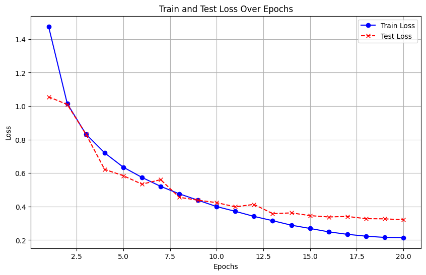

-----
# CIFAR-10 Image Classifier with PyTorch
-----

## Table of Contents

  - [About The Project](#about-the-project)
      - [Built With](#built-with)
  - [Getting Started](#getting-started)
      - [Prerequisites](#prerequisites)
      - [Installation](#installation)
  - [Usage](#usage)
  - [Training Results](#training-results)
  - [Acknowledgments](#acknowledgments)
-----

## About The Project

This project implements a Convolutional Neural Network (CNN) in PyTorch for classifying images from the CIFAR-10 dataset. The CIFAR-10 dataset consists of 60,000 32x32 color images in 10 classes, with 6,000 images per class. This model is designed to accurately categorize these images.

The CNN architecture includes multiple convolutional layers with Batch Normalization and ReLU activations, followed by Max Pooling layers for downsampling. A fully connected classifier with Dropout is used at the end.

Here's a visualization of the training and test loss over epochs:

-----

### Built With

  * [PyTorch](https://pytorch.org/)
  * [Torchvision](https://pytorch.org/vision/stable/index.html)
  * [Matplotlib](https://matplotlib.org/)

-----

## Getting Started

This section will guide you through setting up and running the CIFAR-10 image classifier locally.

-----

### Prerequisites

Ensure you have the following installed on your system:

  * **Python 3.8+**
  * **pip** (Python package installer)
  * **CUDA-enabled GPU** (optional, but highly recommended for faster training. The script will automatically fall back to CPU if CUDA is not available.)

-----

### Installation

1.  **Clone the repository:**

    ```bash
    git clone https://github.com/amanchauhan23/CIFAR10_CNN.git
    cd CIFAR10_CNN
    ```

2.  **Create a virtual environment (recommended):**

    ```bash
    python -m venv venv
    .\venv\Scripts\activate
    ```

3.  **Install dependencies:**

    ```bash
    pip install torch torchvision matplotlib
    ```

    *Note: For specific PyTorch versions with CUDA support, please refer to the [official PyTorch installation instructions](https://pytorch.org/get-started/locally/).*

-----

## Usage

To train the model and evaluate its performance, simply run the Python script(after converting to .py; or run .ipynb file):

```bash
python Cifar10.py
```

The script will:

1.  Automatically download the CIFAR-10 dataset to a `./data` directory.
2.  Initialize the CNN model.
3.  Start the training process for 20 epochs.
4.  Print training and test loss/accuracy at each epoch.
5.  Save the trained model's state dictionary as `CIFAR10_CNN.pth` in the current directory.
6.  Display a plot of the training and test loss over epochs.

The trained model (`CIFAR10_CNN.pth`) can then be loaded for inference:

```python
import torch
from your_project import generate_model # Assuming generate_model is in your script

# Device selection
device = torch.device("cuda" if torch.cuda.is_available() else "cpu")

# Load the saved model
saved_model = generate_model().to(device)
saved_model.load_state_dict(torch.load("./CIFAR10_CNN.pth", map_location=device))
saved_model.eval() # Set the model to evaluation mode

print("Model loaded successfully for inference.")
# You can now use 'saved_model' for making predictions on new images.
```

-----

## Training Results

The model was trained for 20 epochs. Below are the final training and test metrics:

  * **Total Trainable Parameters:** 1,228,874
  * **Final Training Loss:** 0.2141
  * **Final Training Accuracy:** 92.63%
  * **Final Test Loss:** 0.3298 (calculated from the last log entry's `running_loss_test / len(test_dataloader)` value)
  * **Final Test Accuracy:** 89.42%
  * **Total Training Time:** 17.52 minutes (on GTX 1650 TI GPU)

The provided graph visually demonstrates the decrease in both training and test loss over the 20 epochs, indicating that the model learns effectively without significant overfitting.

-----

## Acknowledgments

  * [PyTorch Documentation](https://pytorch.org/docs/stable/index.html)
  * [CIFAR-10 Dataset](https://www.cs.toronto.edu/~kriz/cifar.html)

-----